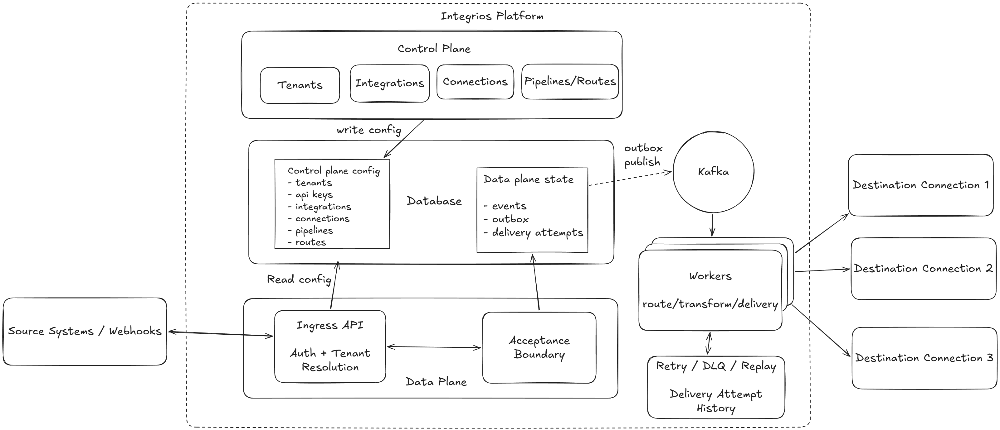

# Integrios

Integrios is a backend integration platform built around the reliability patterns used in event-driven distributed systems.

It is designed for the class of problems where upstream systems need a stable ingestion boundary, downstream systems can fail or slow down unpredictably, and the platform still needs to preserve correctness, tenant isolation, and delivery history.

The project focuses on the foundation of a serious integration system: durable intake, asynchronous handoff, routing, transformation, retries, dead-letter handling, replayability, and operational visibility.

> [!NOTE]
> This project is being built incrementally; the README describes the intended platform architecture and the implemented foundation so far.

## What This Project Demonstrates

- Durable event intake with a clear acceptance boundary
- Transactional outbox for safe asynchronous handoff
- Tenant-scoped machine authentication and isolation
- Routing and transformation as explicit platform concerns
- Delivery reliability patterns such as retries, dead-letter handling, and replay
- Separation between control-plane configuration and data-plane execution
- A practical backend architecture that can evolve from local development to larger multi-instance deployments

## Why This Design

Webhook-heavy and integration-heavy systems tend to fail in predictable ways:

- upstream systems retry when they do not get a timely acknowledgment
- downstream systems become slow, unavailable, or rate-limited
- naive request/response coupling turns transient failures into data loss or duplicated side effects

Integrios is designed around well-established patterns that address those problems directly:

- durable acceptance boundaries to avoid data loss at ingress
- transactional outbox to safely bridge write paths and async processing
- idempotent ingestion and at-least-once delivery semantics
- explicit retry, dead-letter, and replay paths for failure recovery
- strict tenant isolation and auditable delivery history

## Architecture

### Control Plane vs Data Plane

Integrios uses a deliberate split between platform intent and runtime execution.

**Control plane:** tenant lifecycle and boundaries, connection type definitions and capability contracts, tenant connection configuration and secret references, pipeline and route configuration, policy concerns like quotas, limits, and governance.

**Data plane:** ingress request validation, auth, and tenant resolution, durable acceptance-boundary persistence, outbox-driven asynchronous handoff, routing, transformation, and connection delivery execution, retries, dead-letter handling, replay, and delivery tracking, tracing, logging, and operational observability.

This separation keeps runtime processing paths focused, while allowing control logic to evolve independently.

### Core Processing Flow

1. Ingest webhook or API event.
2. Validate request and resolve tenant context.
3. Authenticate tenant-scoped API keys.
4. Persist accepted work at the durable acceptance boundary.
5. Publish through the database + outbox path.
6. Route work using tenant flow configuration.
7. Transform payloads per route rules.
8. Deliver to downstream connections.
9. Track event status and delivery attempt history.
10. Retry, dead-letter, or replay when recovery is needed.

## Key Platform Concepts

### Durable Acceptance Boundary

`Integrios.Ingress` accepts events and persists them durably before acknowledging the caller.

The acceptance boundary is modeled as a single transaction that writes:

- the canonical `events` record
- a corresponding `outbox` record for async processing

This guarantees the system never "accepts without enqueueing" or "enqueues without accepting."

### Transactional Outbox Pattern

The outbox is the handoff between synchronous API requests and asynchronous worker execution.

This pattern avoids dual-write consistency bugs and enables robust worker-side polling or claiming without coupling upstream latency to downstream reliability.

### Idempotency and De-duplication

Callers can provide `idempotency_key` on `POST /events`.

Within a tenant scope, duplicate submissions with the same idempotency key resolve to the same accepted event, preventing duplicate downstream side effects from retries, network timeouts, or webhook replays.

### Multi-Tenant Isolation

Tenants are first-class boundaries in both auth and data access.

API keys resolve to a tenant context, and event reads and writes are tenant-scoped. This prevents cross-tenant data exposure and enables per-tenant operational controls.

### Asynchronous Processing and Backpressure

Worker execution is decoupled from ingestion. API remains responsive under load or downstream instability because event intake is separated from delivery execution.

This allows:

- smoothing bursty traffic
- isolating slow or failing downstream connections
- scaling workers independently from API instances

### Reliability and Failure Resilience

The architecture is built for controlled failure handling:

- retry policies with bounded attempts
- dead-letter queues for terminal failures
- replay paths for safe reprocessing
- delivery attempt history for diagnostics and auditability

This is the standard reliability toolkit for distributed integration systems where downstream availability is variable.

### Scalability Model

Integrios is designed to scale horizontally:

- stateless API instances behind load balancers
- worker concurrency tuned by queue depth and throughput targets
- tenant-aware routing and processing partitioning
- storage-backed durability with clear ownership of consistency boundaries

This model supports progressive evolution from local or single-node operation to larger multi-instance deployments.

## Tech Stack

| Area               | Technology                                        |
| ------------------ | ------------------------------------------------- |
| Language / Runtime | C# / ASP.NET Core                                 |
| Database           | PostgreSQL                                        |
| Event Backbone     | Kafka                                             |
| Observability      | OpenTelemetry + Grafana (Tempo, Loki, Prometheus) |
| Deployment         | Docker-first, cloud-ready                         |

This stack is intentionally practical and proven for backend integration systems: strong transactional storage for acceptance boundaries and outbox consistency, durable event streaming for asynchronous processing and replay, and vendor-neutral observability for operating distributed workflows.

## Example Use Cases

- Central ingress for webhook-heavy ecosystems (payments, CRM, support, commerce, internal systems).
- Tenant-scoped event routing to multiple destination connections with per-route logic.
- Reliable buffering and recovery during downstream outages or rate limiting.
- Auditable event lifecycle tracking for compliance and incident response.
- Reference implementation for outbox-driven integration architecture patterns.
