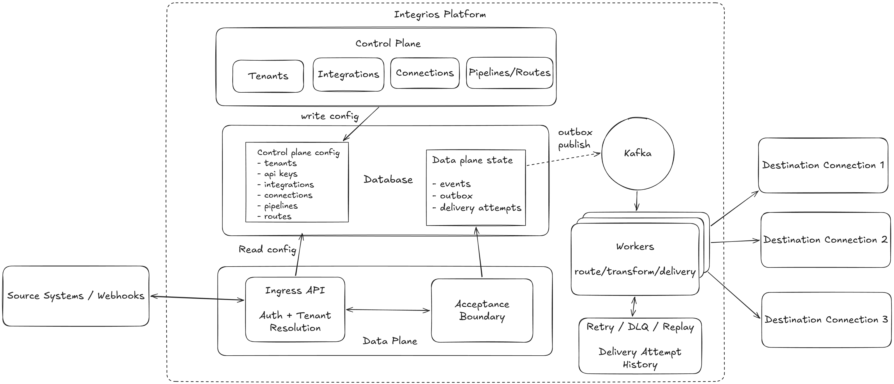

# Architecture

## Why this design

Webhook-heavy and integration-heavy systems tend to fail in predictable ways:

- upstream systems retry when they do not get a timely acknowledgment
- downstream systems become slow, unavailable, or rate-limited
- naive request/response coupling turns transient failures into data loss or duplicated side effects

Integrios is built around well-established patterns that address those problems directly:

- durable acceptance boundaries to avoid data loss at ingress
- a transactional outbox to safely bridge write paths and async processing
- idempotent ingestion and at-least-once delivery semantics
- explicit retry, dead-letter, and replay paths for failure recovery
- strict tenant isolation and auditable delivery history

## Control plane vs data plane

Integrios uses a deliberate split between platform intent and runtime execution.

**Control plane** (`Integrios.Admin`): Operator-owned Tenant lifecycle and boundaries, Integration definitions and capability contracts, Connection configuration and secret references, Topic and Subscription configuration, and policy concerns like quotas, limits, and governance. Tenants are ownership boundaries, not control-plane users.

**Data plane** (`Integrios.Ingress` for intake, `Integrios.Worker` for delivery): ingress request validation, auth, and tenant resolution; durable acceptance-boundary persistence; outbox-driven asynchronous handoff; routing, transformation, and delivery execution against destination connections; retries, dead-lettering, replay, and delivery tracking; plus tracing, logging, and operational observability.

This separation keeps runtime processing paths focused while letting control logic evolve independently.

Generic ApiKey intake is implemented today. Provider-native webhook verification, polling,
normalization, and provider-specific actions describe the Integration boundary Integrios is
building toward; individual adapters arrive incrementally rather than changing the common Event
pipeline.

## Core processing flow

1. Receive an Event from a custom source through generic intake, or from a provider-native Integration trigger.
2. Authenticate generic intake with an Integrios ApiKey, or apply the provider's webhook/polling authentication in its Integration.
3. Resolve the Tenant and source Connection, then normalize provider-native input to the Event contract.
4. Persist accepted work at the durable acceptance boundary.
5. Publish through the database + outbox path.
6. Fan out to matching subscriptions using tenant topic and subscription configuration.
7. Transform payloads per subscription rules.
8. Deliver to destination connections.
9. Track event status and delivery-attempt history.
10. Retry, dead-letter, or replay when recovery is needed.

## Key platform concepts

### Durable acceptance boundary

`Integrios.Ingress` accepts events and persists them durably before acknowledging the caller. The boundary is a single transaction that writes both:

- the canonical `events` record
- a corresponding `outbox` record for async processing

This guarantees the system never "accepts without enqueueing" or "enqueues without accepting."

### Transactional outbox

The outbox is the handoff between synchronous API requests and asynchronous worker execution. It avoids dual-write consistency bugs and lets the worker poll/claim work without coupling upstream latency to downstream reliability.

### Idempotency and de-duplication

Callers can provide an `idempotencyKey` on `POST /events`. Within a tenant scope, duplicate submissions with the same key resolve to the same accepted event, preventing duplicate downstream side effects from retries, network timeouts, or webhook replays.

Every accepted event also identifies its source connection. `POST /events` requires a
`sourceConnectionId`; Ingress accepts it only when the connection belongs to the authenticated
tenant, is active, uses a source-capable integration, and is associated with the selected topic.

### Multi-tenant isolation

Tenants are first-class ownership boundaries in auth and data access, not backend actors. Integrios ApiKeys resolve generic intake to a Tenant context, while provider-native triggers resolve the same context through their Connection. Event reads and writes remain Tenant-scoped to prevent cross-Tenant exposure.

External provider API keys, OAuth credentials, and webhook secrets are not Integrios ApiKeys. The
Operator materializes those values through Tenant-scoped Connection secret references; source and
destination Integration capabilities consume them without persisting resolved values.

### Asynchronous processing and backpressure

Worker execution is decoupled from ingestion, so the intake API stays responsive under load or downstream instability. This allows:

- smoothing bursty traffic
- isolating slow or failing downstream connections
- scaling workers independently from intake instances

### Reliability and failure resilience

The platform is built for controlled failure handling:

- retry policies with bounded attempts
- dead-letter queues for terminal failures
- replay paths for safe reprocessing
- just-in-time, fenced leases that make abandoned per-subscription work reclaimable without letting
  an older worker overwrite a newer result
- atomic delivery-attempt and current-state transitions inside Postgres
- append-only, monotonically numbered delivery-attempt history across retry and replay

Outbound HTTP delivery is at least once. A process can stop after a downstream accepts a request but
before Integrios persists success, so recovery may repeat that logical delivery. Every request
carries stable Event and SubscriptionDelivery identifiers for downstream deduplication plus a
per-attempt identifier and number for diagnostics.

### Scalability model

Integrios scales horizontally, and *differently per deployment*, through configuration and preserved seams rather than bundled infrastructure:

- stateless intake instances behind load balancers
- worker concurrency tuned by queue depth and throughput targets
- tenant-aware routing and processing partitioning
- storage-backed durability with clear ownership of consistency boundaries
- transport behind a port (`IEventBus`): a Postgres outbox/bus by default, with an alternative like Kafka swappable in only when scale justifies it
- observability split into aggregate Operator telemetry and Operator-facing Tenant-scoped drill-down from the durable model, exported to whatever backend the operating team runs

This supports progressive evolution from single-node operation to larger multi-instance deployments without forking the product for a given team's scale.
