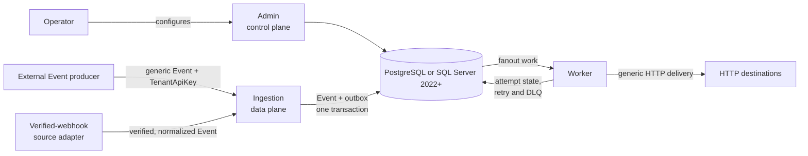

# Architecture

## Product boundary

Integrios is an open-source, self-hostable, Operator-run, multi-tenant HTTP integration platform.
The engineering team running a deployment owns all control-plane configuration. A Tenant is an
ownership and isolation boundary for configuration and runtime data; it is not a control-plane user.

Integrios concentrates on one operational problem: durably accept an Event, apply Tenant-aware
routing and transformation, and reliably deliver it over HTTP while preserving retry, dead-letter,
replay, and attempt history. It is not a no-code workflow builder, connector marketplace, ETL
platform, API gateway, or multi-protocol runtime.

## System shape

External Event producers and generic TenantApiKey intake remain the universal source path. A source
Connection may additionally select the generic verified-webhook source adapter through its
Connector's manifest, which verifies and normalizes a provider's HTTP request before it crosses
the same durable Event-acceptance boundary; see [the GitHub-to-Slack
walkthrough](github-to-slack-walkthrough.md) for a concrete, currently-shipped example.

## Control plane and data plane

Integrios separates platform intent from runtime execution.

**Control plane** (`Integrios.Admin`): Operator-owned Tenant lifecycle, Connector catalog,
Connection configuration and secret references, Topic and Subscription authoring, and transform
preview. Tenants never receive control-plane authority.

**Data plane** (`Integrios.Ingestion` and `Integrios.Worker`): request authentication and Tenant
resolution, source-Connection and Topic validation, durable Event acceptance, fanout, transformation,
HTTP delivery, retries, dead-lettering, replay, and delivery tracking.

The services share the configured PostgreSQL or SQL Server 2022+ database. Admin owns configuration
writes; Worker reads the configuration it needs directly from that database and does not call Admin
at runtime.

## Core model

- **Tenant** is the top-level ownership and isolation boundary.
- **TenantApiKey** is an Integrios-issued machine credential for generic Event intake and resolves one
  Tenant.
- **Connector** is a deployment-wide reusable declarative HTTP contract for an external-system
  class. It may be built in or Operator-authored, is shared across Tenants, and contains no Tenant
  data or Operator-authored executable code.
- **Connection** is a Tenant-owned configured instance of one Connector. It owns Tenant-specific
  endpoint configuration plus separate source-verification and destination-authentication
  selections and secret references. Its source and destination roles are derived from Topic and
  Subscription relationships rather than persisted independently.
- **Topic** is a Tenant-owned named Event stream. Configured source Connections may publish to it.
- **Subscription** independently filters a Topic, optionally transforms matching Events, and
  delivers them through one destination Connection. It owns the versioned HTTP delivery
  configuration and its own delivery/DLQ scope.
- **Event** is the accepted durable work item from one source Connection on one Topic.
- **SubscriptionDelivery** is the per-(Event, Subscription) state and execution snapshot created by
  fanout.
- **DeliveryAttempt** records one concrete outbound execution.

The same Connector can back Connections for many Tenants. For example, one deployment-wide
`klaviyo` Connector can constrain separate Premier Group and Contoso Connections without sharing
their base URIs, credentials, or runtime data.

## Source model

Generic HTTP Event intake through an external **Event producer** is universal. The Event producer is
an Operator-controlled application or automation—such as a source-system plugin, Power Automate
flow, or small service—that:

- owns source-system credentials and provider-specific adaptation
- converts the source change to the generic Integrios Event contract
- authenticates to Integrios with an TenantApiKey
- identifies a configured source Connection and an allowed Topic

A generic, platform-supplied **verified-webhook source adapter** lets an Operator-authored
Connector manifest opt into provider HTTP intake without adding or rebuilding Integrios code. The
manifest supplies signature header, encoding, delivery-identity header, and Event-type-derivation
header as data; the adapter verifies HMAC-SHA256 over the exact raw request body before parsing,
derives a provider-qualified Event type (for example `github.issues.opened`) from that data, and
retains the JSON payload unchanged. The `github-v1` example under
[`examples/connectors/`](../examples/connectors/) is a real, machine-validated instance of this,
not a hypothetical. A curated set of provider-specific *compiled* built-in adapters may be added
later for contracts that don't fit the generic adapter's closed shape; every adapter, generic or
compiled, crosses the same durable Event-acceptance seam.

Operator-authored Connectors cannot load runtime code — the verified-webhook adapter's behavior is
entirely platform-owned, and a manifest only supplies bounded configuration data for it. Polling
remains external Event-producer behavior. Integrios does not commit to a broad provider catalog or
an in-process plugin system.

## Destination model

HTTP(S) is the only destination protocol. One generic HTTP module executes every outbound request;
there are no provider-specific destination adapters or destination-action domain objects.

- a destination Connection owns the absolute base URI, authentication, Tenant-specific non-secret
  configuration, and secret references
- a Subscription owns a versioned method (`POST`, `PUT`, `PATCH`, or `DELETE`), a literal relative
  path, restricted static headers, and a transformed JSON body or explicit no-body
- the relative path always appends to the Connection's base path with one normalized boundary
  slash; it can never replace the Connection's scheme, host, port, or base path
- fanout snapshots the HTTP request shape, relevant non-secret Connection configuration, secret
  references, and the Connector's effective HTTP success rule together, so a later edit
  cannot change an in-flight delivery's request or success criteria; the Worker resolves current
  secret values for each attempt
- a Connector may declare an optional HTTP success rule: the default `status_code` evaluator
  treats any `2xx` response as success, while a `json_boolean` evaluator additionally asserts that a
  configured top-level response field equals an expected boolean, so a provider that returns `2xx`
  for an operation it actually rejected (Slack's `chat.postMessage` is the shipped example) is
  correctly classified as a failure
- failure disposition is fixed platform policy: transport errors, timeouts, and HTTP
  408/429/5xx retry with backoff to exhaustion; every other outcome, including a logically-rejected
  `2xx`, dead-letters immediately for Operator replay; a bounded `Retry-After` on 429/503 is honored
  over the computed backoff when present
- successful response bodies do not become persisted workflow state or new Events; a response body
  is only ever read (bounded) when the success rule requires it

Dynamic headers, arbitrary methods, `GET`/`HEAD`/`CONNECT`/`TRACE`, form or multipart data, binary or
streaming bodies, response-driven workflows, OAuth 2.0 client credentials, and non-HTTP protocols
remain out of scope. Updating several external entities means creating several independent
Subscriptions so each update retains its own retry, DLQ, and replay lifecycle.

## Core processing flow

1. An external Event producer sends the generic Event contract to Ingestion and authenticates with an
   TenantApiKey, or the generic verified-webhook source adapter verifies and normalizes a provider HTTP
   request before Ingestion ever sees an Event contract.
2. Ingestion resolves the Tenant and validates or derives the active source Connection and its Topic
   association.
3. One database transaction writes the canonical Event and its outbox row before Ingestion
   acknowledges acceptance.
4. Worker fanout reads matching active Subscriptions and creates one SubscriptionDelivery for each.
5. Each SubscriptionDelivery is claimed independently, transformed, and sent through the generic
   HTTP delivery module.
6. Worker records the DeliveryAttempt and advances that delivery to success, retry, or dead letter.
7. Replay schedules dead-lettered delivery work again without discarding prior attempt history.

## Durability and delivery semantics

### Durable acceptance and transactional outbox

The Event and outbox row are committed together. This prevents both “accepted without enqueueing”
and “enqueued without accepting.” The outbox decouples source response time from downstream
availability and avoids a database/message-transport dual write.

### Idempotency and source provenance

Generic callers provide a `sourceConnectionId` and may provide an `idempotencyKey`. Ingestion accepts
the source Connection only when it belongs to the authenticated Tenant, is active, uses a
source-capable Connector, and may publish to the selected Topic. Repeated submissions with the
same Tenant-scoped idempotency key resolve to the same accepted Event.

Provider credentials and webhook secrets are not Integrios TenantApiKeys. Connections store logical
secret references; the Operator materializes their values through the deployment's secret provider,
and Worker resolves them immediately before an attempt without persisting the values.

### Independent, at-least-once delivery

Every matching Subscription gets independent state, retry scheduling, dead-lettering, and replay.
One failing destination does not block another.

Outbound HTTP delivery is at least once. A process can stop after a destination accepts a request but
before Integrios records success, so recovery may repeat the logical delivery. Stable Event and
SubscriptionDelivery identifiers let downstream systems deduplicate; per-attempt identifiers support
diagnostics. Fenced leases prevent an older Worker from overwriting a newer authoritative result,
and indeterminate attempts preserve ambiguity rather than reporting a false confirmed failure.

## Scaling and observability

Ingestion instances are stateless and Worker replicas safely claim disjoint work with PostgreSQL
`FOR UPDATE SKIP LOCKED` or equivalent SQL Server locking hints. The configured database is the
durable backbone; another transport should be introduced only when measured scale or operational
pressure justifies it.

Integrios emits structured logs, metrics, and OTLP-capable traces but bundles no production
observability backend. Aggregate telemetry remains low-cardinality; Tenant-specific delivery detail
comes from the durable Event, SubscriptionDelivery, and DeliveryAttempt model.
