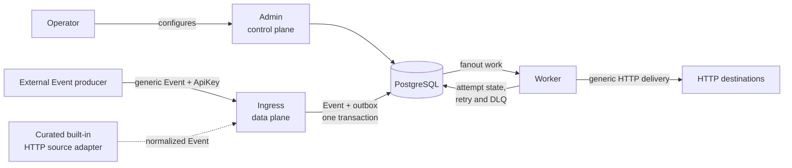

# Architecture

## Product boundary

Integrios is an open-source, self-hostable, Operator-run, multi-tenant HTTP integration platform.
The engineering team running a deployment owns all control-plane configuration. A Tenant is an
ownership and isolation boundary for configuration and runtime data; it is not a control-plane user.

Integrios concentrates on one operational problem: durably accept an Event, apply Tenant-aware
routing and transformation, and reliably deliver it over HTTP while preserving retry, dead-letter,
replay, and attempt history. It is not a no-code workflow builder, connector marketplace, ETL
platform, API gateway, or multi-protocol runtime.

## System shape

The built-in source-adapter path is part of the finalized model but is not implemented in the
current release. External Event producers and generic intake are the universal source path.

## Control plane and data plane

Integrios separates platform intent from runtime execution.

**Control plane** (`Integrios.Admin`): Operator-owned Tenant lifecycle, Integration catalog,
Connection configuration and secret references, Topic and Subscription authoring, and transform
preview. Tenants never receive control-plane authority.

**Data plane** (`Integrios.Ingress` and `Integrios.Worker`): request authentication and Tenant
resolution, source-Connection and Topic validation, durable Event acceptance, fanout, transformation,
HTTP delivery, retries, dead-lettering, replay, and delivery tracking.

The services share PostgreSQL. Admin owns configuration writes; Worker reads the configuration it
needs directly from PostgreSQL and does not call Admin at runtime.

## Core model

- **Tenant** is the top-level ownership and isolation boundary.
- **ApiKey** is an Integrios-issued machine credential for generic Event intake and resolves one
  Tenant.
- **Integration** is a deployment-wide reusable declarative HTTP contract for an external-system
  class. It may be built in or Operator-authored, is shared across Tenants, and contains no Tenant
  data or Operator-authored executable code.
- **Connection** is a Tenant-owned configured instance of one Integration. It owns Tenant-specific
  endpoint configuration, auth selection, and secret references.
- **Topic** is a Tenant-owned named Event stream. Configured source Connections may publish to it.
- **Subscription** independently filters a Topic, optionally transforms matching Events, and
  delivers them through one destination Connection. It owns the versioned HTTP delivery
  configuration and its own delivery/DLQ scope.
- **Event** is the accepted durable work item from one source Connection on one Topic.
- **SubscriptionDelivery** is the per-(Event, Subscription) state and execution snapshot created by
  fanout.
- **DeliveryAttempt** records one concrete outbound execution.

The same Integration can back Connections for many Tenants. For example, one deployment-wide
`klaviyo` Integration can constrain separate Premier Group and Contoso Connections without sharing
their base URIs, credentials, or runtime data.

## Source model

Generic HTTP Event intake through an external **Event producer** is universal. The Event producer is
an Operator-controlled application or automation—such as a source-system plugin, Power Automate
flow, or small service—that:

- owns source-system credentials and provider-specific adaptation
- converts the source change to the generic Integrios Event contract
- authenticates to Integrios with an ApiKey
- identifies a configured source Connection and an allowed Topic

Integrios may later ship a small curated set of built-in provider HTTP source adapters when a
popular, stable contract would otherwise make every adopter repeat meaningful security or
operational work. A GitHub adapter, for example, could verify `X-Hub-Signature-256`, use
`X-GitHub-Delivery` for idempotency, map `X-GitHub-Event` to Event type, handle pings, and retain the
JSON payload. Every built-in adapter must cross the same durable Event-acceptance seam.

Operator-authored Integrations cannot load runtime code. Polling remains external Event-producer
behavior. Integrios does not commit to a broad provider catalog or an in-process plugin system.

## Destination model

HTTP(S) is the only destination protocol. One generic HTTP module executes every outbound request;
there are no provider-specific destination adapters or destination-action domain objects.

In the finalized model:

- a destination Connection owns the absolute base URI, authentication, Tenant-specific non-secret
  configuration, and secret references
- a Subscription owns a versioned method (`POST`, `PUT`, `PATCH`, or `DELETE`), a literal relative
  path or path expression, restricted static headers, and a transformed JSON body or explicit no-body
- a path can never replace the Connection's scheme, host, or port
- OAuth 2.0 client credentials is a reusable auth scheme; interactive OAuth flows are out of scope
- fanout snapshots HTTP configuration, relevant non-secret Connection configuration, and secret
  references; the Worker resolves current secret values for each attempt
- any `2xx` response is success; other outcomes follow the fixed retry/DLQ policy
- successful response bodies do not become persisted workflow state or new Events

Dynamic headers, arbitrary methods, `GET`/`HEAD`/`CONNECT`/`TRACE`, form or multipart data, binary or
streaming bodies, response-driven workflows, and non-HTTP protocols are out of scope. Updating
several external entities means creating several independent Subscriptions so each update retains
its own retry, DLQ, and replay lifecycle.

The current release implements a narrower slice: the built-in `webhook` Integration, fixed JSON
`POST` delivery to an absolute `Connection.config.url`, and open, API-key-header, or bearer-token
authentication. Operator-authored Integrations, richer Subscription-owned HTTP configuration,
OAuth client credentials, and curated built-in source adapters are target capabilities, not shipped
features.

## Core processing flow

1. An external Event producer sends the generic Event contract to Ingress and authenticates with an
   ApiKey. A future curated built-in adapter may instead verify and normalize a provider HTTP request.
2. Ingress resolves the Tenant and validates or derives the active source Connection and its Topic
   association.
3. One PostgreSQL transaction writes the canonical Event and its outbox row before Ingress
   acknowledges acceptance.
4. Worker fanout reads matching active Subscriptions and creates one SubscriptionDelivery for each.
5. Each SubscriptionDelivery is claimed independently, transformed, and sent through the generic
   HTTP delivery module.
6. Worker records the DeliveryAttempt and advances that delivery to success, retry, or dead letter.
7. Replay schedules dead-lettered delivery work again without discarding prior attempt history.

## Durability and delivery semantics

### Durable acceptance and transactional outbox

The Event and outbox row are committed together. This prevents both “accepted without enqueueing”
and “enqueued without accepting.” The outbox decouples source response time from downstream
availability and avoids a database/message-transport dual write.

### Idempotency and source provenance

Generic callers provide a `sourceConnectionId` and may provide an `idempotencyKey`. Ingress accepts
the source Connection only when it belongs to the authenticated Tenant, is active, uses a
source-capable Integration, and may publish to the selected Topic. Repeated submissions with the
same Tenant-scoped idempotency key resolve to the same accepted Event.

Provider credentials and webhook secrets are not Integrios ApiKeys. Connections store logical
secret references; the Operator materializes their values through the deployment's secret provider,
and Worker resolves them immediately before an attempt without persisting the values.

### Independent, at-least-once delivery

Every matching Subscription gets independent state, retry scheduling, dead-lettering, and replay.
One failing destination does not block another.

Outbound HTTP delivery is at least once. A process can stop after a destination accepts a request but
before Integrios records success, so recovery may repeat the logical delivery. Stable Event and
SubscriptionDelivery identifiers let downstream systems deduplicate; per-attempt identifiers support
diagnostics. Fenced leases prevent an older Worker from overwriting a newer authoritative result,
and indeterminate attempts preserve ambiguity rather than reporting a false confirmed failure.

## Scaling and observability

Ingress instances are stateless and Worker replicas safely claim disjoint PostgreSQL work with
`FOR UPDATE SKIP LOCKED`. PostgreSQL is the current durable backbone; another transport should be
introduced only when measured scale or operational pressure justifies it.

Integrios emits structured logs, metrics, and OTLP-capable traces but bundles no production
observability backend. Aggregate telemetry remains low-cardinality; Tenant-specific delivery detail
comes from the durable Event, SubscriptionDelivery, and DeliveryAttempt model.
