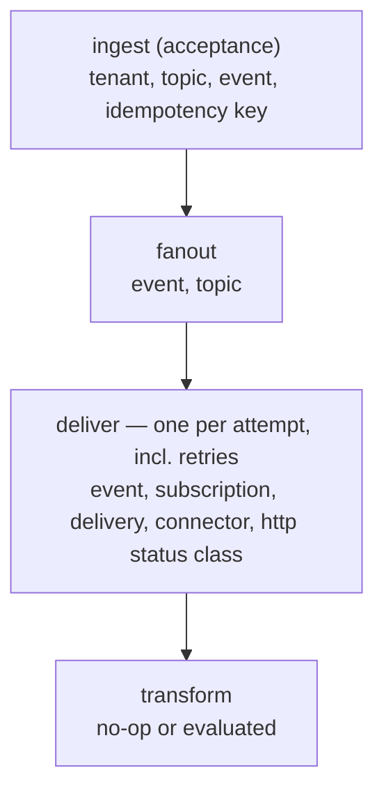

# Observability

Integrios is instrumented for **metrics, structured logs, and distributed traces** using
OpenTelemetry. Observability is a pluggable capability: the platform emits standard,
vendor-neutral telemetry and **bundles no backend**. You point it at whatever stack you
run — Prometheus, Grafana, Tempo, Loki, Datadog, or an OpenTelemetry Collector.

There are two operational planes for one audience, the **Operator** running the deployment:

- The **aggregate telemetry plane** provides platform health — ingest rate, queue depth,
  delivery success and failure by destination class, dead-letter trends — from low-cardinality
  metrics and traces.
- The **Tenant-scoped detail plane** provides per-event delivery state and attempt history from the
  durable model via the Admin API. (Per-Tenant detail stays in the database and in traces,
  never in metric labels.)

The default path is a **Prometheus scrape endpoint plus structured stdout logs**. OTLP
export is available and **off by default** — turn it on to ship telemetry to your own
backend.

## Metrics

Every service exposes a Prometheus-format `/metrics` endpoint.

| Endpoint | Local URL | In-cluster port |
|----------|-----------|-----------------|
| Ingestion `/metrics` | http://localhost:5231/metrics | `8080` |
| Admin `/metrics` | http://localhost:5150/metrics | `8080` |
| Worker `/metrics` | — | `5299` (`WorkerMetricsPort`) |

The Worker has no host-published HTTP port; scrape it on its metrics port (default `5299`,
configurable via `WorkerMetricsPort`) from inside your network.

### Application metrics

Alongside standard ASP.NET Core, HttpClient, and runtime metrics, Integrios emits:

| Metric | Type | Labels | Meaning |
|--------|------|--------|---------|
| `integrios_events_ingested_total` | counter | — | events accepted at the ingestion boundary (excludes idempotent duplicates) |
| `integrios_events_unrouted_total` | counter | — | events that matched no Subscription during fanout |
| `integrios_fanout_rows_created_total` | counter | — | per-subscription delivery rows created by fanout |
| `integrios_deliveries_succeeded_total` | counter | `connector_key` | successful deliveries, by destination connector class |
| `integrios_deliveries_failed_total` | counter | `connector_key`, `http_status_class` | transient delivery failures (will retry) |
| `integrios_deliveries_dead_lettered_total` | counter | `connector_key` | deliveries that exhausted their retry budget |
| `integrios_delivery_secret_resolution_failures_total` | counter | `connector_key` | attempts that could not resolve a required secret reference |
| `integrios_delivery_request_construction_failures_total` | counter | `connector_key` | attempts that could not construct a valid outbound request |
| `integrios_delivery_stale_finalizations_total` | counter | — | finalization results discarded after delivery ownership was lost |
| `integrios_delivery_attempt_duration_seconds` | histogram | `result`, `connector_key` | outbound attempt latency |
| `integrios_outbox_pending_depth` | gauge | — | Worker-owned deployment-global count of unprocessed outbox rows; your primary "is the worker keeping up?" signal |

The outbox-depth gauge is exposed only by the Worker. Its value is sampled asynchronously from the
configured database and may lag by one sampling interval (15 seconds by default), so scraping never
waits on a database query. In a deployment with multiple Worker replicas, every replica reports the same
deployment-global value; aggregate them with `max(integrios_outbox_pending_depth)`, never `sum`.

Configure the sampling interval with
`Integrios__Telemetry__OutboxDepthSampleInterval` (a positive .NET `TimeSpan`, for example
`00:00:30`).

`http_status_class` is one of `2xx`, `4xx`, `5xx`, `timeout` (the downstream did not respond
in time), or `error` (a failure with no HTTP response, such as a transform error or a
connection failure).

> [!NOTE]
> Metric labels are deliberately **low-cardinality and platform-owned** (`connector_key`,
> `http_status_class`, `result`). Tenant-controlled dimensions such as tenant, subscription,
> or connection identifiers never appear as metric labels — they live in traces and in the
> database. This keeps your metrics backend cheap regardless of how many tenants you onboard.

## Traces

Each accepted event produces a single **continuous trace** spanning intake, fanout, and
delivery — including retries that happen minutes or hours later — without any reading of
database rows. Trace context (W3C `traceparent`) is persisted across the asynchronous hops
and restored on the consuming side, so the chain stays connected across process and time
boundaries.



Spans are tagged with identifiers (including `tenant_id`) so you can filter traces by tenant
or destination when investigating a specific problem. The transform step is its own span, so
you can tell a transform failure apart from a downstream HTTP failure at a glance.

Worker batch ticks are their own operational spans and are intentionally **not** attached to
any single event's trace.

## Logs

Logs are **structured and written to stdout** (no log backend is bundled). Log lines carry
scope keys — `event_id`, `delivery_id`, `subscription_id` — so you can search for a specific
event without pattern-matching free-form text. When a trace is active, lines also carry
`TraceId` and `SpanId`, letting you jump from a log entry to the corresponding trace in your
backend.

## Exporting to your own backend (OTLP)

Set an OTLP endpoint to export traces to your own collector or backend. Metrics remain on the
Prometheus scrape endpoints and structured logs remain on stdout:

```bash
# Standard OpenTelemetry variable
OTEL_EXPORTER_OTLP_ENDPOINT=http://otel-collector:4317

# or the Integrios-specific setting
Integrios__Telemetry__OtlpEndpoint=http://otel-collector:4317
```

With no endpoint set, spans are still produced in-process and metrics remain available on
the Prometheus scrape endpoint; nothing is exported. No Collector, Tempo, or Loki is bundled
or required.

## Local Prometheus and Grafana

For local development, `docker compose up` (or `make up`) also starts a Prometheus and a
Grafana preconfigured to scrape all three services and load an operator dashboard. **This is
a development convenience, not a production backend** — in production you run your own.

| Tool | URL | Notes |
|------|-----|-------|
| Prometheus | http://localhost:9090 | Targets page shows ingestion, admin, and worker as `UP` |
| Grafana | http://localhost:3000 | Anonymous access; opens to the **Integrios Overview** dashboard |

The provisioned dashboard shows ingest rate, outbox pending depth, delivery success by
connector, failures by HTTP status class, dead-letter trends, and delivery-duration
percentiles. Configuration lives under `infra/` and is version-controlled, so the dashboard
is reproducible.

> [!TIP]
> If host port `3000` is already in use, remap Grafana with a `compose.override.yml`
> (gitignored), for example `ports: ["3001:3000"]`.
